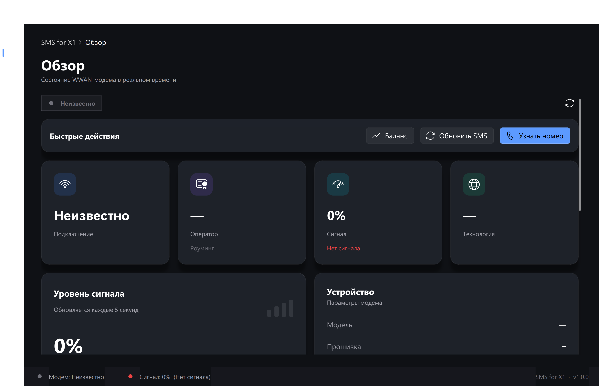
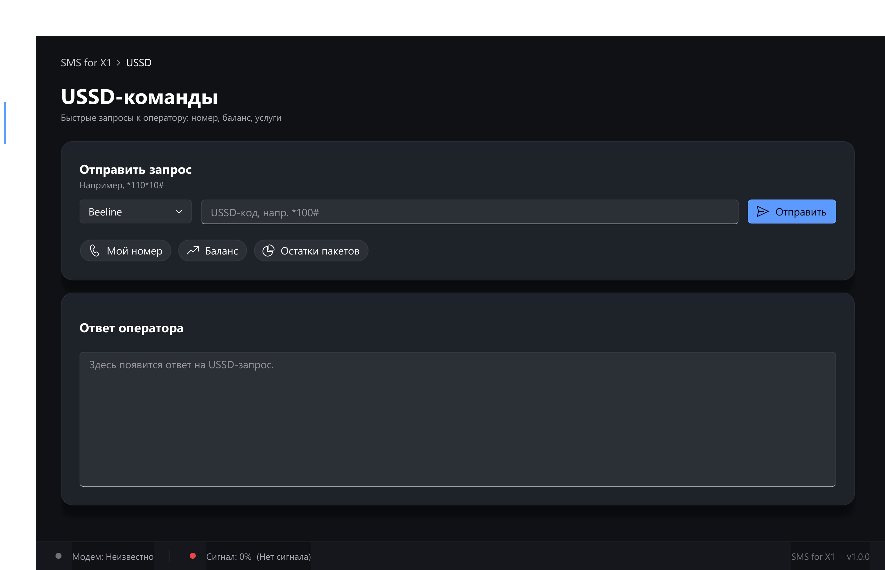
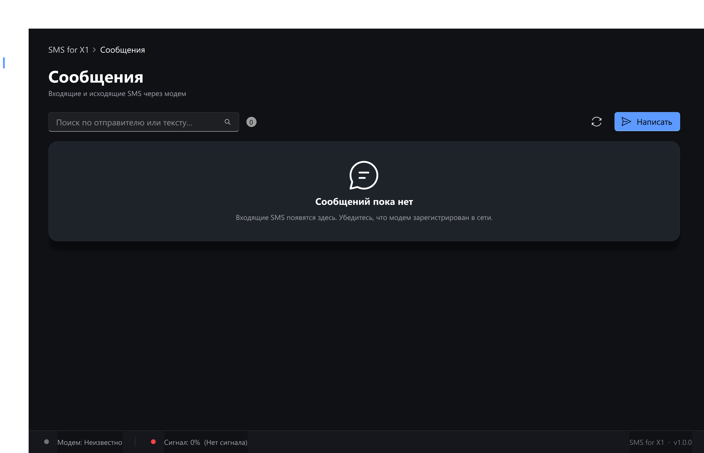

<div align="center">


# SMS for X1

**Премиальное приложение управления WWAN-модемом ThinkPad X1 Carbon**

Читайте SMS, отправляйте USSD-запросы, переключайте режимы модема и следите
за качеством связи и базовой станцией — в одном красивом интерфейсе.


</div>

---

## ✨ Возможности

- 📊 **Обзор в реальном времени** — статус подключения, оператор, сигнал, технология, SIM-слоты
- 📡 **Карточка базовой станции** — Band, Cell ID, PCI, EARFCN, TAC, RSRP/RSRQ и оценка качества
- 💬 **SMS** — чтение входящих, поиск, отправка новых сообщений
- 🔢 **USSD** — быстрые пресеты («Узнать номер», «Баланс») для Beeline, МТС, МегаФон, Tele2 + произвольные коды
- 🛠 **Управление модемом** — радиомодуль, подключение, переключение SIM-слотов (Multi-SIM)
- 🔌 **COM-порт** — выбор порта и автоопределение AT-интерфейса
- ⚡ **Быстрые действия** прямо с главного экрана

## 🎨 Интерфейс

Тёмная тема, Fluent Design с эффектами Mica/Acrylic, стеклянные карточки,
плавные анимации и микровзаимодействия. Единая палитра, современная
типографика, полностью адаптивная вёрстка.

<div align="center">

<br/><br/>


</div>

## 🚀 Установка

Нужен **Python 3.10+** и **Windows 11** (WWAN-модем с поддержкой Mobile Broadband).

```bash
git clone https://github.com/<user>/sms-for-x1.git
cd sms-for-x1

python -m venv .venv
.venv\Scripts\activate
pip install -r requirements.txt
```

## ▶️ Запуск

```bash
python -m smsx1
```

Или без консоли — двойной клик по **`run.bat`**.

## 🏗 Архитектура

Приложение построено по паттерну **MVVM**:

```
smsx1/
├── core/            # Model — сервисы и данные (без Qt)
│   ├── models.py            # dataclasses: ModemStatus, CellInfo, SmsMessage …
│   ├── modem_service.py     # статус/режимы через netsh mbn
│   ├── sms_service.py       # SMS через Windows WinRT (winsdk)
│   ├── ussd_service.py      # USSD через WinRT
│   ├── cell_service.py      # данные соты + расчёт Band по EARFCN
│   └── serial_service.py    # COM-порт, автоопределение AT
├── viewmodels/      # ViewModel — состояние и фоновые воркеры
│   ├── app_state.py         # единый источник состояния, сигналы
│   └── worker.py            # пул потоков, чтобы UI не подвисал
└── ui/              # View — PySide6 + qfluentwidgets
    ├── theme.py             # тема, тени, анимации
    ├── main_window.py       # frameless-окно, Mica, навигация
    ├── status_bar.py
    ├── components/          # карточки, бейджи, индикаторы
    └── pages/               # экраны: обзор, сообщения, USSD, модем, настройки
```

## 🔧 Технологии

| Слой | Технология |
|------|-----------|
| GUI | [PySide6](https://doc.qt.io/qtforpython/) (Qt 6) |
| Компоненты | [PySide6-Fluent-Widgets](https://qfluentwidgets.com) |
| SMS / USSD / сота | Windows Runtime через [winsdk](https://pypi.org/project/winsdk/) |
| Статус / режимы | `netsh mbn` |
| Serial / AT | [pyserial](https://pyserial.readthedocs.io) |

## 📝 Заметки о модеме

Приложение делалось под **Quectel EM120R-GL** (ThinkPad X1 Carbon Gen 9).
Модем работает в режиме **MBIM**, поэтому SMS и USSD идут через Windows WinRT,
а не через AT-команды. Детальные данные соты (Band, Cell ID) доступны через
`MobileBroadbandModem.tryGetCellInfoAsync` — их наличие зависит от модема и прав.

## 📄 Лицензия

[MIT](LICENSE). Зависимость `qfluentwidgets` распространяется под собственной
лицензией (GPLv3 для бесплатной редакции) — см. [qfluentwidgets.com](https://qfluentwidgets.com).

---

<div align="center">
<sub>Сделано с ❤️ для ThinkPad X1 Carbon · v1.0.0</sub>
</div>
